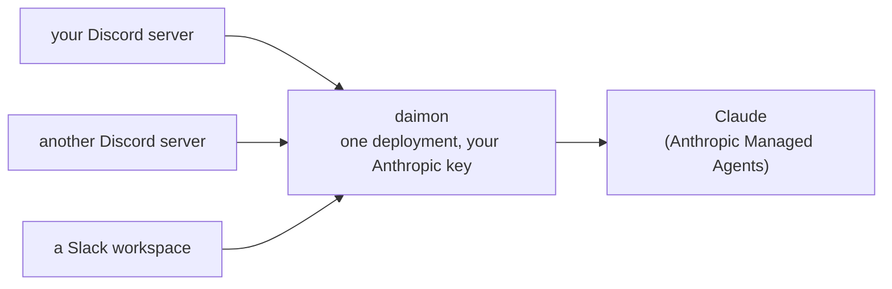
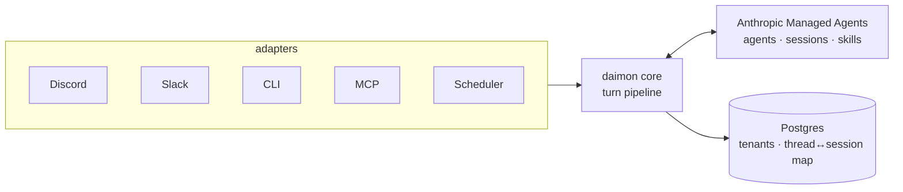

<div align="center">
  

# daimon

**Your team just hired a data scientist.**

daimon is a collaborative data science agent in your team's Discord or Slack.
It writes and runs code, fits Bayesian models with PyMC, and delivers charts
and runnable notebooks in the thread.

[](https://github.com/pymc-labs/daimon/actions/workflows/ci.yml)
[](LICENSE)
[](pyproject.toml)

**[Add it to your server in one click →](https://daimon.decision.ai/)**
or self-host it from this repo.

</div>

## It's yours. And it's open.

Most chat bots are one agent shared across a workspace. daimon is
many-to-many: you deploy it once, on your own Anthropic API key, and any
number of Discord servers install it from that single deployment. Every
server is isolated: one tenant, its own data, scoped to that server. Adding
a server takes about two minutes: invite the bot, run `/agent-setup`, and
everyone in it can `@mention` a working agent.

Built on [Anthropic Managed Agents](https://platform.claude.com/docs/en/managed-agents/quickstart)
by [PyMC Labs](https://www.pymc-labs.com), the team behind the PyMC project.

> **Status:** early. The code is public and you can run it yourself (see
> below), but self-hosting is not a supported path yet. Expect rough edges
> and breaking changes. The hosted version at
> [daimon.decision.ai](https://daimon.decision.ai/) is the easy path.

## It doesn't chat. It does the work.

- `@daimon` in a channel starts (or continues) a threaded conversation with
  session continuity
- Slash-command admin surface: `/agent-setup`, `/routines`, `/billing`,
  `/privacy`, `/help`. Setup and routines require Discord's `Manage Server`
  permission; the rest are open to everyone
- Scheduled routines: recurring agent runs dispatched headlessly
- Slack adapter (optional) with full Discord parity, per-workspace OAuth
  install, and opt-in per-user access ([`docs/slack.md`](docs/slack.md))
- CLI and MCP adapters sharing the same core turn pipeline
- Tenant isolation enforced at the database `tenant_id` layer, so one shared
  Anthropic key can safely power every guild

## How it works



You run one copy of daimon. Every community that installs it gets its own
agent with its own memory, and none of them can see each other's data. When
someone `@mention`s the bot, daimon hands the conversation to Claude and
posts the replies back into the thread.

<details>
<summary>Technical architecture</summary>



A turn: the adapter derives the tenant from platform identity, core opens or
resumes a Managed Agents session, streams its events, and the adapter renders
deltas into the thread until the session goes idle.

- `daimon.core` owns schema, stores, and the turn pipeline, and imports no
  adapters. Each adapter owns one platform's I/O and auth, and adapters never
  import each other. `import-linter` enforces both rules in CI.
- Managed Agents holds the agents, environments, sessions, and skills
  themselves. Postgres holds only metadata about them: tenant identity,
  thread-to-session mappings, config, credentials, and billing.
- One Discord guild (or Slack workspace) is one tenant. Isolation lives at
  the database `tenant_id` layer, not the API-key boundary.

</details>

## Run it yourself

Unsupported, but it works. You need an Anthropic API key **with Managed
Agents beta access** (a closed beta: request access first, or session
creation will fail) **in a workspace dedicated to this deployment** (daimon
manages the workspace's Managed Agents resources as its own, so sharing the
workspace with anything else causes collisions),
[Docker](https://docs.docker.com/get-docker/), and
[`uv`](https://docs.astral.sh/uv/).

### 1. Configure environment

```bash
cp .env.example .env
```

Open `.env`, then uncomment and fill in:

- `DAIMON_ANTHROPIC__API_KEY`: your beta-enabled Anthropic key
- `DAIMON_MCP__JWT_SECRET`: any random string (e.g. `openssl rand -hex 32`)
- `DAIMON_MCP__PUBLIC_URL`: `http://localhost:8765/mcp` is fine for local use
- `POSTGRES_PASSWORD`: a strong, URL-safe value (avoid `@ : / % #`)

All four must be set before your first `docker compose` command:
`docker-compose.yml` interpolates them for every service with fail-fast
`${VAR:?...}` guards, even for `docker compose up -d postgres`. You'll add
the Discord bot token in step 4. `.env` is gitignored, so secrets never get
committed.

### 2. Install dependencies

```bash
uv sync --all-extras --all-packages
```

### 3. Start Postgres and run migrations

```bash
docker compose up -d postgres
export DAIMON_DATABASE_URL=postgresql+asyncpg://daimon:<your-POSTGRES_PASSWORD>@localhost:5432/daimon
uv run alembic upgrade head
```

The `export` is required because the `alembic` CLI reads the shell
environment and does not auto-load `.env`.

Then seed the default agents, environments, and skills:

```bash
uv run daimon defaults apply
```

### 4. Create the Discord application

1. Create an application in the
   [Discord Developer Portal](https://discord.com/developers/applications).
2. Under **Bot**, create a bot user and copy its token into `.env` as
   `DAIMON_DISCORD__BOT_TOKEN`.
3. Still under **Bot**, enable the **Message Content Intent**. It's a
   privileged intent, and without the portal toggle the bot can't read
   mentions.
4. Under **OAuth2 → URL Generator**, select the `bot` and
   `applications.commands` scopes, then under **Bot Permissions** select at
   least `Send Messages`, `Send Messages in Threads`,
   `Create Public Threads`, `Manage Threads`, and `Read Message History`.
5. Open the generated URL in a browser and invite the bot to a test server
   you control.

### 5. Run the bot

```bash
uv run python -m daimon.adapters.discord
```

Send a message that `@mention`s the bot. It replies in a new thread, and
that's a working deployment. `docker-compose.yml` also runs the full stack
(Postgres plus the `mcp`, `discord`, and `scheduler` process groups) from
one image if you'd rather not run processes by hand.

## Layout

- `packages/core/` — `daimon-core` library (MA client, stores, turn pipeline)
- `packages/adapters/cli/` — the `daimon` admin CLI
- `packages/adapters/discord/` — the Discord bot adapter
- `packages/adapters/mcp/` — the MCP server adapter
- `packages/adapters/slack/` — the Slack adapter (optional)
- `packages/adapters/scheduler/` — the routines scheduler adapter
- `packages/testing/` — shared test fixtures/harness
- `apps/notebook-host/` — standalone marimo notebook host service
- `defaults/` — YAML defaults seeded into Managed Agents + local DB
- `tests/` — cross-package integration tests

## Contributing

See [`CONTRIBUTING.md`](CONTRIBUTING.md) for dev environment setup and the
quality gates every PR must keep green.

## Security

See [`SECURITY.md`](SECURITY.md) for how to report a vulnerability.

## License

[MIT](LICENSE)
