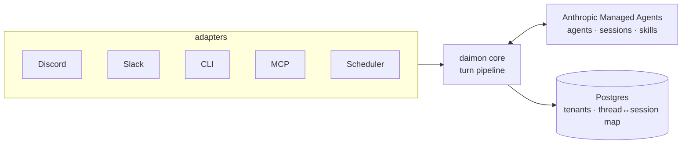

<div align="center">
  

# daimon

**The open source data science agent for Discord and Slack.**

daimon joins your team's chat, writes and runs code, fits Bayesian models
with [PyMC](https://www.pymc.io), and posts charts and runnable notebooks
back into the thread.

[](https://github.com/pymc-labs/daimon/actions/workflows/ci.yml)
[](pyproject.toml)
[](https://github.com/astral-sh/ruff)
[](https://microsoft.github.io/pyright/)
[](LICENSE)

**[Add it to your server in one click →](https://daimon.decision.ai/)**
or self-host it from this repo.

[Self-hosting guide](docs/self-hosting.md) ·
[Slack setup](docs/slack.md) ·
[Claude Code plugin](plugin/README.md) ·
[Changelog](CHANGELOG.md)

</div>

## What it does

- **Answers in the thread.** `@mention` the bot in a channel and it opens a
  thread, runs the analysis, and replies with a fitted model, a chart, a
  plain-English read on the uncertainty, and a [marimo](https://marimo.io)
  notebook that reproduces the result.
- **Works with the whole team.** Anyone in the server can follow up in the
  same thread. Sessions keep their context across turns.
- **Runs on a schedule.** Routines run recurring analyses headlessly and post
  the results where you ask.
- **Connects to your tools.** Ask it to connect Notion, Linear, GitHub or any
  other MCP server. Token-based servers are shared per agent; OAuth servers
  are connected per person.
- **Reachable from Claude Code.** The bundled [plugin](plugin/README.md)
  logs in through Slack or Discord OAuth and exposes every daimon you belong
  to as an MCP server.
- **One deployment, many communities.** Deploy once on your own Anthropic
  API key. Any number of Discord servers and Slack workspaces can install
  it, each as an isolated tenant with its own agent, memory and data.

Everything is done in conversation. Slash commands (`/agent-setup`,
`/routines`, `/billing`, `/privacy`, `/help`) exist for people who prefer
them.

## Example prompts

> "Here's last quarter's sales export. We changed pricing in week 6. Did it
> actually help?"

> "Is variant B actually better than A, or is that just noise?"

> "Forecast next month's signups, with uncertainty bands."

> "Every Monday at 9am, pull the weekend's numbers and post a summary here."

## Quickstart

You need [Docker](https://docs.docker.com/get-docker/) and an Anthropic API
key in a workspace dedicated to this deployment.

1. Configure the environment.

   ```bash
   git clone https://github.com/pymc-labs/daimon.git && cd daimon
   cp .env.example .env
   ```

   In `.env`, set `DAIMON_ANTHROPIC__API_KEY`, `DAIMON_MCP__JWT_SECRET` (any
   random string), `DAIMON_MCP__PUBLIC_URL` (`http://localhost:8765/mcp` for
   local use) and `POSTGRES_PASSWORD`.

2. Create a Discord bot in the
   [Developer Portal](https://discord.com/developers/applications), enable
   the **Message Content Intent**, put its token in `.env` as
   `DAIMON_DISCORD__BOT_TOKEN`, and invite it to a server you control.

3. Start the stack.

   ```bash
   docker compose up --build -d
   ```

   This brings up Postgres, runs migrations, seeds the default agents and
   skills, and starts the MCP, Discord and scheduler services.

`@mention` the bot in a channel. It replies in a new thread. If it stays
silent, check `docker compose logs discord`.

The [self-hosting guide](docs/self-hosting.md) covers Discord permissions in
detail, running without Docker, Slack, the Claude Code login mounts, chart
storage and connecting MCP servers. Prefer to skip all of that? The hosted
version at [daimon.decision.ai](https://daimon.decision.ai/) installs in one
click, no API key or server required.

## How it works


```mermaid
flowchart LR
    subgraph adapters
        direction TB
        Discord
        Slack
        CLI
        MCP
        Scheduler
    end
    adapters --> core["daimon core<br>turn pipeline"]
    core <--> ma["Anthropic Managed Agents<br>agents · sessions · skills"]
    core --> pg[("Postgres<br>tenants · thread↔session map")]
```

daimon is built on
[Anthropic Managed Agents](https://platform.claude.com/docs/en/managed-agents/quickstart).
A turn works like this: the adapter derives the tenant from platform
identity, core opens or resumes a Managed Agents session, streams its
events, and the adapter renders the deltas into the thread until the session
goes idle.

- `daimon.core` owns the schema, stores and turn pipeline and imports no
  adapters. Each adapter owns one platform's I/O and auth, and adapters never
  import each other. `import-linter` enforces both rules in CI.
- Managed Agents holds the agents, environments, sessions and skills.
  Postgres holds only metadata: tenant identity, thread-to-session mappings,
  config, credentials and billing.
- One Discord guild or Slack workspace is one tenant. Isolation is enforced
  at the database `tenant_id` layer, so one Anthropic key can safely serve
  every install.

## Repository layout

| Path | What it is |
| --- | --- |
| `packages/core/` | `daimon-core`: Managed Agents client, stores, turn pipeline |
| `packages/adapters/discord/` | Discord bot adapter |
| `packages/adapters/slack/` | Slack adapter (optional, early) |
| `packages/adapters/mcp/` | MCP server adapter and agent tools |
| `packages/adapters/scheduler/` | Routines scheduler |
| `packages/adapters/cli/` | `daimon` admin CLI |
| `packages/mux/` | Provider-agnostic managed-agent interface |
| `packages/testing/` | Shared test fixtures |
| `apps/notebook-host/` | Standalone marimo notebook host |
| `apps/report-host/` | Standalone report host |
| `plugin/` | Claude Code plugin |
| `defaults/` | YAML defaults seeded into Managed Agents and the database |
| `docs/` | Operator documentation |
| `tests/` | Cross-package integration and platform-parity tests |

## Status

Early. Self-hosting works and is documented. Expect rough edges and breaking
changes while things settle; see the [changelog](CHANGELOG.md) for what
moved.

## Contributing

Bug reports and pull requests are welcome. Start with
[`CONTRIBUTING.md`](CONTRIBUTING.md) for the dev setup and the quality gates
every PR keeps green, and look for issues labelled
[`good first issue`](https://github.com/pymc-labs/daimon/labels/good%20first%20issue).

Report vulnerabilities privately as described in
[`SECURITY.md`](SECURITY.md). What a deployment stores about its users is in
[`PRIVACY.md`](PRIVACY.md).

## About

daimon is built by [PyMC Labs](https://www.pymc-labs.com), the team behind
the PyMC project.

Licensed under the [MIT License](LICENSE).
