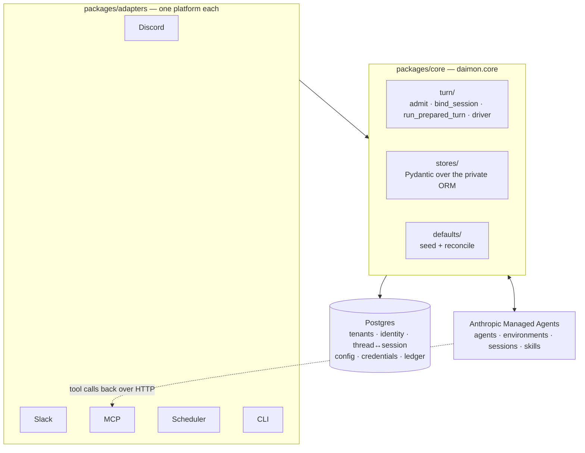

# Architecture

daimon is built on
[Anthropic Managed Agents](https://platform.claude.com/docs/en/managed-agents/quickstart).
Managed Agents (MA) owns the agent, its sandbox, its skills and the session
that runs a turn. daimon owns everything around that: the chat surfaces, the
tenancy model, the config cascade, credentials, the credit ledger, and the
pipeline that turns a chat message into a session and streams the result back
into a thread.

This page is the map to read before the code. `CONTRIBUTING.md` has the dev
setup and the quality gates; [configuration.md](configuration.md) has every
setting; [self-hosting.md](self-hosting.md) has the deployment.

## The shape

The dotted edge is worth noticing early: the MCP adapter is both an inbound
adapter and the server the running agent calls its tools on. That is why a
turn started from Discord still reaches `packages/adapters/mcp/` — the
sandbox makes an authenticated HTTP call back to it mid-turn.

## Packages, and why the boundaries exist

| Package | Path | Owns |
| --- | --- | --- |
| `daimon.core` | `packages/core/daimon/core/` | Schema and migrations, stores, MA helpers, the turn pipeline. Imports no adapter. |
| `daimon.adapters.discord` | `packages/adapters/discord/` | Discord I/O, rendering, permissions, slash commands. |
| `daimon.adapters.slack` | `packages/adapters/slack/` | Slack I/O, Block Kit rendering, per-user OAuth. |
| `daimon.adapters.mcp` | `packages/adapters/mcp/` | The MCP server the agent calls, plus the OAuth, webhook and hub HTTP routes. |
| `daimon.adapters.scheduler` | `packages/adapters/scheduler/` | The routine poll loop. |
| `daimon.adapters.cli` | `packages/adapters/cli/` | The `daimon` admin binary. |
| `daimon.testing` | `packages/testing/` | Shared fixtures. |
| `mux` | `packages/mux/` | A separate namespace, not part of `daimon`. See [mux.md](mux.md). |
| `notebook_host`, `report_host` | `apps/*/src/` | Standalone services that talk to daimon over HTTP only. |

None of that is convention. Eight `import-linter` contracts in the root
`pyproject.toml` are the authority, run as `uv run lint-imports` in pre-commit
and CI:

| Contract | Forbids |
| --- | --- |
| Core must not import adapters | `daimon.core` → `daimon.adapters` |
| Adapters must not import each other | any of cli, mcp, discord, scheduler, slack → another |
| ORM module is private to stores and defaults | anything but `daimon.core.stores.**` / `daimon.core.defaults.**` → `daimon.core._models` |
| Core must not import testing | `daimon.core` → `daimon.testing` |
| CLI admin commands and run must not import each other | `daimon.adapters.cli.commands` ⟂ `daimon.adapters.cli.run` |
| Mux must not import daimon | `mux` → `daimon` |
| notebook-host must not import daimon | `notebook_host` → `daimon` |
| report-host must not import daimon | `report_host` → `daimon` |

The first two make the platform surfaces replaceable: a change to how Slack
renders a table cannot reach Discord, and core can be exercised without any
chat client. The ORM contract is the one contributors trip over most — the
schema lives in `packages/core/daimon/core/_models.py` behind a leading
underscore, and everything outside `daimon.core.stores` and
`daimon.core.defaults` sees Pydantic models from
`packages/core/daimon/core/stores/domain.py` instead of SQLAlchemy rows. `packages/core/tests/test_orm_import_contract.py` fails when the
contract's enumerated module list drifts from the directory, because
import-linter cannot express "every sibling except `_models`".

The last three are trust boundaries rather than tidiness: a service that
cannot import `daimon` cannot hold the Anthropic key or a database
credential, whatever a future contributor is tempted to do inside it.

## How a message becomes a turn

Discord and Slack run the same two-stage chokepoint in `daimon.core.turn`.
The staging is deliberate — neither stage returns a boolean, both raise typed
errors, so an adapter cannot forget a gate.

**Stage one, `admit()` — `packages/core/daimon/core/turn/admission.py`.** One
call does identity resolution, config resolution, and every pre-turn gate, and
returns a frozen `Admission` (account id, MA agent, MA environment, resolved
config). The order is load-bearing and documented as such in the module:

1. Resolve the platform user to an `accounts` row, via
   `get_or_create_platform_principal` in
   `packages/core/daimon/core/stores/identity.py`.
2. Resolve config through the cascade
   `thread → channel → tenant → deployment`, in
   `packages/core/daimon/core/stores/scoped_config_read.py`. The tiers are
   named by `ConfigTier` in `packages/core/daimon/core/scope.py`; the bottom
   one comes from `defaults/config.yaml`, see [defaults.md](defaults.md).
3. Raise `MissingTurnConfigError` if no agent or environment resolved — before
   any MA call, so a misconfigured tenant sees the config error rather than a
   billing one.
4. Resolve the agent and environment to live MA ids via
   `packages/core/daimon/core/ma_resolver.py`, which self-heals by re-running
   defaults reconciliation when a tag no longer resolves, and rejects an agent
   whose `archived_at` is set.
5. Balance gate — `tenant_balance.is_over_balance`.
6. Monthly cap gate — `billing.is_over_cap`.

Either gate raises `AdmissionDenied`. See [billing.md](billing.md).

**Stage two, `bind_session()` — `packages/core/daimon/core/turn/prepare.py`.**
Finds the live `thread_sessions` row for this thread or creates a fresh MA
session, assembles every `create_session` argument (credential env mount, MCP
vault, repo resource, memory store), writes the mapping row, and binds the
usage recorder. It returns a frozen `PreparedTurn` whose recorder field is
underscore-prefixed: adapters never construct billing wiring, and the only way
to reach the recorder is to hand the `PreparedTurn` back to stage three.

Whether an existing session may be reused, refreshed in place, or must be
replaced is decided in `packages/core/daimon/core/session_preparation.py`
against the fingerprints stored on the mapping row; the outcome rides back on
`PreparedTurn.continuity` so the adapter can say what happened.

**Stage three, `run_prepared_turn()` —
`packages/core/daimon/core/turn/run.py`.** Calls the driver, and on a
dead-session 404 recovers exactly once: mark the mapping dead, create a
replacement, read the dead session's event log back into the reseeded message,
rebind the recorder, re-run. A second dead signature is returned as-is.

Both stages two and three are wrapped by one shared per-turn ceiling from
`packages/core/daimon/core/turn/ceiling.py` — `TURN_CEILING_S`, 45 minutes. It
is a backstop against an MA session that never leaves `running`, not a latency
target; legitimate turns that fit a model or build a notebook run for many
minutes. `admit()` sits deliberately outside it.

### The driver

`packages/core/daimon/core/turn/driver.py` opens the SSE stream, posts the
user message, and runs a consume loop and a render loop concurrently until the
session goes idle or errors. Adapters plug in through the `TurnLifecycle`
protocol in `packages/core/daimon/core/turn/lifecycle.py`, which documents a
per-hook cost contract:
`on_render` is the sole content-delivery path and may talk to the network,
because it runs on its own task and cannot stall the pump; `on_sse_event` is
awaited inline in the consume loop and must stay a cheap local tap.

Reconnection is two loops for two failure modes. The outer loop handles
eventless cycles — the server closes cleanly roughly every ten minutes by
design — and asks MA whether the session is still running before reconnecting,
so silence can never be mistaken for a truncated success. The inner
`AsyncRetrying` block is a bounded two-attempt budget for a genuinely dropped
connection. The outer loop has no attempt cap; the per-turn ceiling is its
only backstop.

Every call must declare a billing posture, from
`packages/core/daimon/core/turn/posture.py`: `Billed` meters each
`span.model_request_end` event through the bound recorder, `BillingExempt`
meters nothing and logs why.

## Tenancy and isolation

One Discord guild or one Slack workspace is one tenant. The tenant UUID is
derived, not allocated: `derive_tenant_uuid(platform, workspace_id)` in
`packages/core/daimon/core/ma_identity.py` is a UUID5 under a frozen
namespace, so the same workspace maps to the same tenant across database
resets and processes.

Isolation is enforced in two places at once.

**In Postgres.** Tenant-scoped tables carry `tenant_id` with a cascading FK to
`tenants.id`, and stores take `tenant_id` as a parameter rather than reading
it from anywhere ambient. Erasure is not left to cascades:
`packages/core/daimon/core/purge.py` deletes every row referencing a principal
in FK-safe order in one transaction, and
`packages/core/daimon/core/privacy.py` is its read-only mirror for the preview
panel. A schema-reflecting drift-guard test fails when a new person-scoped
table joins one path and not the other.

**In Managed Agents.** One deployment runs on one Anthropic key, so tenant
separation inside the MA workspace is carried by metadata stamps defined in
`packages/core/daimon/core/defaults/metadata.py` — `daimon_tenant`,
`daimon_account`, `daimon_name`, `daimon_managed`, `daimon_spec_hash`. The
resolver checks the `daimon_tenant` stamp on every cached-id retrieve, so a
stale id belonging to another tenant is rejected rather than used. Credentials
never enter a prompt: they are mounted into the session as an encrypted env
file (`packages/core/daimon/core/credential_env.py`) or brokered per call
(`packages/core/daimon/core/broker/`), and the MCP server the sandbox calls
back into authenticates a JWT whose `agent_id` claim is the derived agent
UUID from `packages/core/daimon/core/ma_identity.py`.

## Sessions and Managed Agents

A turn does not create a session per message. `thread_sessions` maps
`(tenant, platform, thread)` to one MA session id, and its `status` column
carries the lifecycle: `live` is the caller's current session, `dead` is one MA
no longer has, `superseded` points at the successor that carries its work
through `replaced_by_id`, and `retired` is an explicit fresh start. That
lineage is why a thread can survive a session replacement with its context
intact.

What MA holds is the agent, the environment, the skills and the session
transcript. What Postgres holds is metadata: identity, the mapping above, the
config cascade, credentials and billing. An MA session freezes its agent spec
at creation time, so the agent read at admission is not necessarily what
executes — the mapping row stores a `SessionSnapshot` of the configuration the
session is actually running (`packages/core/daimon/core/session_snapshot.py`),
and that snapshot, not the current spec, is what later turns compare and bill
against.

## Entry points that are not a chat message

- **Scheduled routines** go through
  `packages/core/daimon/core/headless_runner.py`, which creates a session with
  the same `create_session` the chat path uses and delegates the drain to the
  same driver under the same ceiling — but it calls neither `admit()` nor
  `bind_session()`. See [routines.md](routines.md).
- **MCP agent-chat tools**, in
  `packages/adapters/mcp/daimon/adapters/mcp/tools/agent_chat.py`, let a caller
  drive a session directly. They do not use the chokepoint either; they re-run
  the same balance and cap gates through `_admit` in
  `packages/adapters/mcp/daimon/adapters/mcp/tools/_ctx.py` and create
  sessions via `daimon.core.sessions.create_session`.
- **`daimon run`**, in
  `packages/adapters/cli/daimon/adapters/cli/run/command.py`, is a single-turn
  subprocess entry point that calls `run_turn` directly with `BillingExempt`.

If you add a fourth, reuse `admit()` rather than re-deriving the gate order.

## Standalone apps

`apps/notebook-host/` serves published marimo notebooks, spawning one
`marimo edit` subprocess per notebook behind a reverse proxy.
`apps/report-host/` serves one published PDF report with a chat sidebar.
Both are FastAPI processes that hold no Anthropic key and no database
credential; they reach daimon over HTTP with capability tokens, and the
`must not import daimon` contracts keep it that way.

## Where to look next

- [routines.md](routines.md) — the scheduler and headless turns.
- [billing.md](billing.md) — metering, the gates, the ledger.
- [defaults.md](defaults.md) — what is seeded and how reconciliation works.
- [mcp-tools.md](mcp-tools.md) — every tool the agent can call.
- [configuration.md](configuration.md) — every setting.
