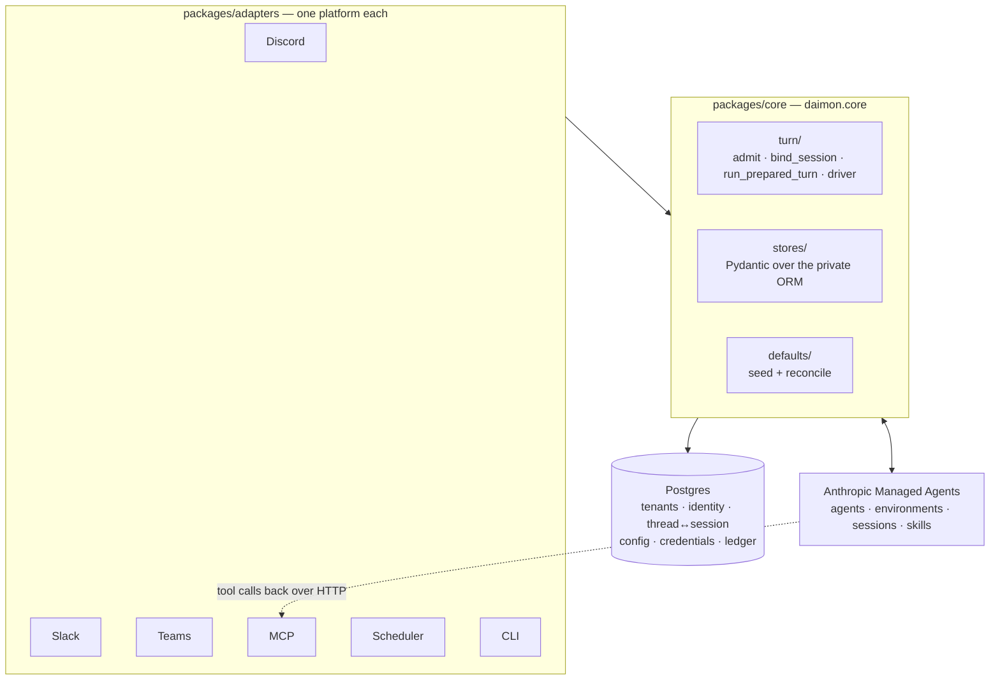

# Architecture

daimon is built on
[Anthropic Managed Agents](https://platform.claude.com/docs/en/managed-agents/quickstart).
Managed Agents (MA) owns the agent, its sandbox, its skills and the session
that runs a turn. daimon owns everything around that: the chat surfaces, the
tenancy model, the config cascade, credentials, the credit ledger, and the
pipeline that turns a chat message into a session and streams the result back
into a thread.

This page is the map to read before the code. `CONTRIBUTING.md` has the dev
setup and the quality gates; [configuration.md](configuration.md) has every
setting; [self-hosting.md](self-hosting.md) has the deployment.

Discord, Slack, scheduler and MCP emit `runtime.health` every 30 seconds with
Anthropic response attempts, database pool use, event loop lag and active turns.

## The shape


```mermaid
flowchart TB
    subgraph adapters["packages/adapters — one platform each"]
        direction LR
        Discord
        Slack
        Teams
        MCP
        Scheduler
        CLI
    end

    subgraph core["packages/core — daimon.core"]
        direction LR
        turn["turn/<br>admit · bind_session · run_prepared_turn · driver"]
        stores["stores/<br>Pydantic over the private ORM"]
        defaults["defaults/<br>seed + reconcile"]
    end

    adapters --> core
    core <--> ma["Anthropic Managed Agents<br>agents · environments · sessions · skills"]
    core --> pg[("Postgres<br>tenants · identity · thread↔session<br>config · credentials · ledger")]
    ma -. "tool calls back over HTTP" .-> MCP
```

The dotted edge is worth noticing early: the MCP adapter is both an inbound
adapter and the server the running agent calls its tools on. That is why a
turn started from Discord still reaches `packages/adapters/mcp/` — the
sandbox makes an authenticated HTTP call back to it mid-turn.

## Packages, and why the boundaries exist

| Package | Path | Owns |
| --- | --- | --- |
| `daimon.core` | `packages/core/daimon/core/` | Schema and migrations, stores, MA helpers, the turn pipeline. Imports no adapter. |
| `daimon.adapters.discord` | `packages/adapters/discord/` | Discord I/O, rendering, permissions, slash commands. |
| `daimon.adapters.slack` | `packages/adapters/slack/` | Slack I/O, Block Kit rendering, per-user OAuth. |
| `daimon.adapters.teams` | `packages/adapters/teams/` | Teams HTTP ingress, Adaptive Card rendering, text commands and panels, file consent delivery, channel files through SharePoint. |
| `daimon.adapters.mcp` | `packages/adapters/mcp/` | The MCP server the agent calls, plus the OAuth, webhook and hub HTTP routes. |
| `daimon.adapters.scheduler` | `packages/adapters/scheduler/` | The routine poll loop. |
| `daimon.adapters.cli` | `packages/adapters/cli/` | The `daimon` admin binary. |
| `daimon.testing` | `packages/testing/` | Shared fixtures. |
| `mux` | `packages/mux/` | A separate namespace, not part of `daimon`. See [mux.md](mux.md). |
| `notebook_host`, `report_host` | `apps/*/src/` | Standalone services that talk to daimon over HTTP only. |

None of that is convention. Eight `import-linter` contracts in the root
`pyproject.toml` are the authority, run as `uv run lint-imports` in pre-commit
and CI:

| Contract | Forbids |
| --- | --- |
| Core must not import adapters | `daimon.core` → `daimon.adapters` |
| Adapters must not import each other | any of cli, mcp, discord, scheduler, slack, teams → another |
| ORM module is private to stores and defaults | anything but `daimon.core.stores.**` / `daimon.core.defaults.**` → `daimon.core._models` |
| Core must not import testing | `daimon.core` → `daimon.testing` |
| CLI admin commands and run must not import each other | `daimon.adapters.cli.commands` ⟂ `daimon.adapters.cli.run` |
| Mux must not import daimon | `mux` → `daimon` |
| notebook-host must not import daimon | `notebook_host` → `daimon` |
| report-host must not import daimon | `report_host` → `daimon` |

The first two make the platform surfaces replaceable: a change to how Slack
renders a table cannot reach Discord, and core can be exercised without any
chat client. The ORM contract is the one contributors trip over most — the
schema lives in `packages/core/daimon/core/_models.py` behind a leading
underscore, and everything outside `daimon.core.stores` and
`daimon.core.defaults` sees Pydantic models from
`packages/core/daimon/core/stores/domain.py` instead of SQLAlchemy rows. `packages/core/tests/test_orm_import_contract.py` fails when the
contract's enumerated module list drifts from the directory, because
import-linter cannot express "every sibling except `_models`".

The last three are trust boundaries rather than tidiness: a service that
cannot import `daimon` cannot hold the Anthropic key or a database
credential, whatever a future contributor is tempted to do inside it.

## How a message becomes a turn

Discord, Slack and Teams run the same two-stage chokepoint in `daimon.core.turn`.
The staging is deliberate — neither stage returns a boolean, both raise typed
errors, so an adapter cannot forget a gate.

**Stage one, `admit()` — `packages/core/daimon/core/turn/admission.py`.** One
call does identity resolution, config resolution, and every pre-turn gate, and
returns a frozen `Admission` (account id, MA agent, MA environment, resolved
config). The order is load-bearing and documented as such in the module:

1. Resolve the platform user to an `accounts` row, via
   `get_or_create_platform_principal` in
   `packages/core/daimon/core/stores/identity.py`.
2. Channel protection — a turn whose reply would land in a protected channel,
   a thread under one or (Discord) a channel in a protected category raises
   `AdmissionDenied("channel_protected")`, admins included. It runs before the
   invoker gate, whose refusal would otherwise be posted there. If a Discord
   thread's category can't be resolved while any category is protected, the
   turn is refused.
3. Invoker policy — the tenant's access policy (below) may restrict who can
   start a turn. A refused user raises `AdmissionDenied("invoker_not_allowed")`
   before the cascade, so they learn nothing about the tenant's configuration
   and no MA call is made.
4. Resolve config through the cascade
   `thread → channel → tenant → deployment`, in
   `packages/core/daimon/core/stores/scoped_config_read.py`. The tiers are
   named by `ConfigTier` in `packages/core/daimon/core/scope.py`; the bottom
   one comes from `defaults/config.yaml`, see [defaults.md](defaults.md).
5. Raise `MissingTurnConfigError` if no agent or environment resolved — before
   any MA call, so a misconfigured tenant sees the config error rather than a
   billing one.
6. Resolve the agent and environment to live MA ids via
   `packages/core/daimon/core/ma_resolver.py`, which self-heals by re-running
   defaults reconciliation when a tag no longer resolves, and rejects an agent
   whose `archived_at` is set.
7. Balance gate — `tenant_balance.is_over_balance`.
8. Monthly cap gate — `billing.is_over_cap`.
9. Channel budget gate — `channel_budget.is_over_channel_budget`, against the
   parent channel, or for a DM the channel it was moved from with `/dm`
   (`dm_source_channel_id`); skipped in an older DM or where the channel has
   no budget. The channel is carried on `Admission.channel_id` so every debit
   for the turn is attributed to it.

The policy, protection, balance, cap and channel budget gates each raise `AdmissionDenied` with a
reason literal; each adapter renders its own notice. See [billing.md](billing.md).

A Slack `app_mention` runs a turn only when its text contains the bot's own
`<@U…>` mention token, follow-ups in a thread included. Slack's docs say the
event fires only on a direct mention, but installs have reported it arriving
for thread replies that never mentioned the bot, so `_handle_app_mention`
checks the text itself, as Discord checks `message.mentions`. The bot's user
id comes from `auth.test`, cached per workspace. The check runs after dedup and
the token read and before the Slack Connect rejection, so an external sender
who never addressed the bot gets no notice. A dropped event is logged as
`slack.event_dropped.no_explicit_mention`; a failed `auth.test` drops the event
without an error reply.

An unmentioned reply in a Discord or Teams thread costs one cascade read of
`thread_participation_scopes`. In a followed thread it joins a quiet-timer
batch; once the thread goes quiet the shared gates in
`packages/core/daimon/core/participation_gates.py` run the hourly cap, balance,
cap and channel budget checks, then the metered classifier. A `respond`
verdict runs an ordinary turn through `admit()` as the burst's newest author,
with every notice withheld. Teams also counts a quote of the bot's message as
a mention.

Discord checks its per-guild in-flight limit before the optional process-wide
turn limit (`DAIMON_DISCORD__MAX_CONCURRENT_TURNS`). Guild mentions, unprompted
replies and DMs count against it; an excess requested turn gets a retry notice.
Unprompted replies follow their existing silent-refusal policy. Continuation
wakes retain their existing admission path. The limit is unset by default and
applies only to this Discord process.

Discord, Slack and Teams also limit simultaneous chat turns per tenant before admission.
`daimon tenants turn-cap PLATFORM WORKSPACE_ID N` stores a tenant override;
`default` clears it and restores the adapter's deployment setting (3 by default).
The check covers Discord mentions, thread participation and wizard submits,
Slack mentions, and Teams messages, wakes and thread participation. It does not limit MCP or routine turns.

A protected channel hears nothing from the agent, not even a refusal or an
error. Each turn entry decides FIRST, before tenant liveness, provisioning or
any other read that can fail, whether the agent may post there:
`protection_state` (`packages/core/daimon/core/turn/protection.py`) returns
`unprotected`, `protected` or `unknown`, and never raises -- a policy that
doesn't parse, a database or pool failure, or a failed category lookup all
give `unknown`. The channel and its parent are checked first; a Discord
thread's uncached parent is fetched for its category only when the policy
protects a category and the channel isn't already protected, and cached so
admission doesn't fetch it again. Anything but `unprotected` drops the turn
with only a log line, and the entries' error boundaries post only when the
state is `unprotected`. The entries are Discord `on_message`, organic thread
participation, wizard submit and continuation turns, and Slack
`_handle_app_mention` (with a second check in `_orchestrate` after it claims
the thread, and on its ephemeral shed notice), and Teams `_handle` and
thread participation (plus the refusals `handle_message` posts). The continuation dispatchers (Teams uses
core `continuity/dispatch.py`), which can post skip or responder-changed copy
outside any turn (from the wake poller or a credential submission), ask the
same decision right before each post and settle the row skipped without
posting when it isn't `unprotected`.

**Tenant access policy — `packages/core/daimon/core/access_policy.py`.** One
`TenantAccessPolicy` per tenant, stored as JSON in `tenant_access_policies`
(`packages/core/daimon/core/stores/access_policy.py`). A tenant with no row
gets the open default, so nothing changes until a policy is written; a present
row that is not a valid policy object (JSON `null` included) raises
`AccessPolicyUnreadable` and callers refuse rather than fall open. Unknown
fields are rejected too, so rolling back past a release that added a field
locks the tenant out until the row is rewritten.

Who counts as an admin differs by path. `admit()` trusts only the live role the
adapter passes; no role means non-admin. The MCP turn tools (`ask`,
`start_turn`, `continue_turn`, on the hub and per agent, plus billed media)
and routine fires have no live platform role, so they use the account's
stored role (and role ids, for channel admins), refreshed on every chat turn. The operator path
(`platform_user_id` unset: CLI and internal tokens) is not a platform member
and skips the policy, as it skips billing. Ids are the platform's own (Discord snowflakes, Slack ids, Teams Entra object and
conversation ids):

| Field | Empty means | Enforced by |
| --- | --- | --- |
| `invoker_user_ids` | anyone may start a turn; admins always may | `admit()`, the MCP turn tools (`_admit` in `tools/_ctx.py`), routine fires |
| `protected_channel_ids`, `protected_category_ids` | nothing is write-protected | `admit()` (the turn's own reply, on every path: mention, follow-up, wizard submit, continuation) and every Discord, Slack and Teams write tool, via `require_channel_writable` in `packages/adapters/mcp/daimon/adapters/mcp/tools/_channel_policy.py` |
| `sealed_channel_ids` | nothing is sealed | the channel read tools (`read_channel`, `read_thread`, `get_message`, `list_threads`, `search_messages`) via `ChannelReadPolicy`, which the dispatcher in `tools/channels.py` loads per call; the session transcript tools (`list_sessions`, `get_session`, `list_session_events`, agent chat's `list_my_sessions`, `get_my_session`, `list_events`, `continue_turn` and the rest, and the hub's) via `tools/_session_access.py`; `admit()` also sets `Admission.memory_read_only` for a turn from a sealed channel or a thread under one |
| `isolated_channel_ids` | nothing is isolated | `authorize()` (`channel_isolated`), asked by admission and `reauthorize`, the routine save and fire checks, the channel write, read and DM tools and every channel default bind (tools, panels, the CLI's `config` writes); visibility in the agent, skill, routine, routing and handoff MCP tools (`tools/_isolation.py`), the hub, the setup panel for members and `/memory`. See Channel isolation below |
| `dm_memory_read_only` (default `false`) | DM turns get writable memory | `admit(is_dm=True)` sets `Admission.memory_read_only` |
| `agent_channel_pins` | every agent runs wherever the cascade sends it | `admit()` after the agent is retrieved (every turn path: mention, follow-up, wizard submit, continuation, handoff thread, DM), the MCP and hub turn tools (`_admit` in `tools/_ctx.py`: `start_turn`, `ask`, `continue_turn`, new or resumed), `hand_off_task` via `decide_handoff`, `fork_agent` (a pinned agent can't be copied), and routines at save (`_check_agent_pin`) and at every fire (scheduler) |

Protection covers threads under a protected channel and, on Discord, channels
in a protected category; it applies to admins too, and runs after the caller's
own permission check so it never reveals a channel the caller cannot see. A
sealed channel's content is readable only from a turn inside it (the channel
or a thread under it): the read must pass the `origin_context_id` from that
turn's controls, and a missing, expired or foreign origin counts as outside.
The origin must also belong to the agent the token executes as (`agent_id`,
or `chat_agent_id` for ordinary chat); a token bound to neither can't claim
one. A single thread can be sealed on its own: a Discord thread by its id, a
Slack thread as `channel_id:thread_ts`. Such a thread, its messages and (on
Discord) its name are withheld from outside turns: in `read_thread` and
`get_message`, in channel history (a Slack thread's root and broadcast replies;
Discord's thread-created notice, whose text is the name), in `list_threads`
and in search. The CLI's `--sealed-channel` accepts the Slack form. Once
anything is sealed, search reports only the hits it shows as its total, scoped
or not, on both platforms, and Discord hints at more results only when a full
page of visible hits came back, so neither the count nor the hint can reveal
sealed matches. A Slack
turn inside a thread sealed on its own also gets read-only memory. An origin is any active
one of the same account and responder, not only the current turn's: a member
who copies an origin id out of a sealed-channel turn can read that channel
from elsewhere until it expires -- someone who could read it anyway.
Outside reads are refused after the platform's own caller check, and search
drops sealed hits.

A session transcript holds everything its turns saw, so the transcript tools
apply the same seal. `admit()` records the turn's channel and thread on the
`Admission`, with every id that seals it (its channel and a thread sealed on
its own), and `create_session` stamps them on the session (`daimon_channel`,
`daimon_thread`, `daimon_sealed=<ids>`; `daimon.core.session_seal`). The
recorded seal only grows: a sealed turn that reuses a session adds its id
(`bind_session`, which waits rather than run the turn if Managed Agents
refuses the update mid-turn), and a session that replaces another -- by
transcript, checkpoint, bundle, handoff or dead-session recovery -- inherits
its predecessor's ids, or is sealed to its own thread when the predecessor
can't be read. Each read or follow-up requires the calling turn's origin to be
inside every recorded id, whatever the current policy, and judges the channel
and thread against the current policy as a channel read would: the main MCP
server's session tools take the calling turn's `origin_context_id`, claimable
only by a chat turn's own credential; agent-chat keys run outside every
channel, so they never list, read or continue a sealed conversation, and the
hub does the same for members. A workspace admin may list and read any sealed
conversation from the hub, and a channel admin those of the channels they
administer whose every seal lies there too (the channel, a thread in it, or
its `channel:ts`), but continue none (see [Trust model](#trust-model)).
Sealing a channel later covers its existing sessions, and unsealing never
releases a session that ran sealed -- only that thread, when the thread was
sealed on its own. A session from before the stamp that a thread ran on
(`thread_sessions`) has no known
parent channel: while the tenant seals anything it is shown only to a turn in
that same thread. Nor can a sealed turn open or drive another session to carry
its content out: agent chat's `start_turn`, `ask` and `continue_turn` are off
the surface a chat turn's token (`chat_agent_id`) sees, and refuse that
credential outright if they are ever reached with it
(`_require_outside_chat_turn`), so every session they create comes from a
headless caller outside every channel. The one exception is an agent key
minted with "Use from your coding tools" in a sealed channel, or in a channel
its agent is pinned to (a thread counts as its parent): its `mcp_tokens` row
records that channel (`coding_token_channel`), and its calls run as a turn
there -- under the channel's pin, seal, environment and budget, with its
sessions stamped to the channel (`token_channel_id`). `authorize` sees it as
the place of the key's turns (`mcp_place`) and as the read origin, nowhere
else, and re-decides both at the moment of action; the seal is read right
before a session is created, and a conversation opened before its channel was
sealed can be read but not continued. Keys minted anywhere else are
unchanged. A server admin mints anywhere; a channel admin of every channel an
agent is pinned to mints for it only from inside one of those channels, and
that token is always bound there (`authorize(MINT_CODING_TOKEN)`, through
`authorize_coding_token`). Operators edit the policy with the CLI:

```bash
daimon tenants access-policy get discord GUILD_ID [--json]
daimon tenants access-policy set discord GUILD_ID --invoker USER_ID --invoker USER_ID \
    --protected-channel CHANNEL_ID --protected-category CATEGORY_ID \
    --sealed-channel CHANNEL_ID --isolated-channel CHANNEL_ID [--dm-memory-read-only]
daimon tenants access-policy set discord GUILD_ID \
    --add-pin-agent AGENT=CHANNEL_ID --add-pin-agent AGENT=CHANNEL_ID
daimon tenants access-policy set discord GUILD_ID --remove-pin-agent AGENT[=CHANNEL_ID]
daimon tenants access-policy set discord GUILD_ID \
    --pin-agent AGENT=CHANNEL_ID [--replace-pins]   # replace every pin
daimon tenants access-policy set discord GUILD_ID --clear   # back to open
```

A pinned agent runs only in its listed channels and the threads under them.
The pin is keyed by agent name and checked against both the cascade's name and
the agent's own metadata name, so a thread handed to the agent by id is
covered. A turn anywhere else is refused with `agent_pinned_elsewhere`, a
member's DM included. Admins are exempt only where the reply reaches no one
else -- their own DM and hub turns -- and even there the agent's channel sends
reach only its pinned channels (see [Trust model](#trust-model)). `hand_off_task` refuses to bring
a pinned agent into another channel before anything is written. A pinned
agent's routine must post straight into a pinned channel (a channel
destination, not a thread or none), because the scheduler cannot resolve a
Discord thread's parent at fire time; it is refused at save and skipped at
fire otherwise.

`fork_agent` is admin-only and refuses a pinned source: a copy would be the
agent's prompt, skills and connectors under a name with no pin. A fork also
starts with no credentials (no GitHub access, repo binding or proof, and no
agent-wide MCP token), so copying an agent never hands out another project's
access; MCP servers that only work with a stored token are left off the copy.

An MCP or hub turn (`start_turn`, `ask`, `continue_turn`, on a new session or
a resumed one) runs in no channel, so it is outside every pin, as a DM is: the
policy is read on every call, and a pinned agent is refused before any session
is created or message sent. Only the operator's internal tokens, which carry
no platform user, bypass it.

Cross-agent protection is complete only for pinned agents: an unpinned agent
still answers wherever the cascade sends it, so pin every client project
agent. Beyond the pin, whatever an agent can reach (its repo, keys,
connectors and memory) is also guarded where a member could otherwise borrow
it:

- `hand_off_task` lets a member hand a thread only to the agent the channel
  itself answers with; any other destination needs an admin.
- `create_routine` and `update_routine` let a member schedule only the agent
  they are talking to, or the agent the destination channel answers with.
  Routines are listed and read only by their creator and admins.
- `fork_agent` is admin-only and forks start credential-less (above).

Each flag given replaces that whole field (repeat it for several ids);
fields not given keep their stored value, including concurrent CLI edits.
Pins are edited in place instead: `--add-pin-agent` adds channels to one
agent's pin and `--remove-pin-agent` drops one channel or the whole pin, and
every other agent's pin is kept, so onboarding a second client never unpins
the first. An unpinned agent runs anywhere (pins fail open), so every way of
dropping a pin is explicit and refused otherwise: removing a pin or channel
that isn't stored, removing an agent's last channel by id (use the bare
`--remove-pin-agent AGENT`), naming one agent in both `--add-pin-agent` and
`--remove-pin-agent`, or mixing the bare and `AGENT=CHANNEL_ID` remove forms
for one agent. Pin names must match an agent of the tenant exactly; a name
that only matches after NFKC and case folding is refused with the right one.
A Slack `D…` id is never a pin channel. `--pin-agent` still replaces the whole
map (rewriting the channels of every agent it names), but refuses to drop an
agent it doesn't name unless `--replace-pins` is given, and `--clear` needs
`--replace-pins` when pins exist. Every `set` prints the resulting policy and
a line for each agent left unpinned. Onboarding a client uses
`--add-pin-agent`. An empty pin map is left out of the stored row.

A private DM conversation (`dm:` scope) is outside every pin wherever it is
checked: admission, `hand_off_task`, and continuations owed to a DM, which are
admitted as DM turns. Adding a key, connector token, skill-repo token or repo
binding to a pinned agent (`request_agent_key`, `request_mcp_token`,
`request_mcp_oauth`, `request_skill_repo_token`, `request_repo_binding`) or
pointing it at a public repo (`bind_public_repo`) needs an admin, a channel
admin of every channel it is pinned to, or a request made inside one of its
channels. The form's submit
(Discord, Slack and Teams) re-checks the rule against the agent as it is now, resolved by its stable id
and checked by every name a pin can be keyed by (`core/agent_pins.py`), so a
pin added later or a rename still holds; a target that can't be resolved under
a pin is refused. The direct configuration tools (`update_agent`,
`attach_mcp_server`, `detach_mcp_server`, `remove_agent_key`, `remove_skill`)
take no turn origin, so on a pinned agent they are an admin's or a channel
admin's of every pinned channel; members inside its channels use the request
tools. An agent key's self-edit tools (`set_repo_binding`/`clear_repo_binding`/
`self_write_file`/`self_delete_file`) are refused on a pinned agent: an agent
key's stored roles are never trusted, so neither exemption applies to it. One
guard (`tools/_pin_guard.py`) serves all of them.
A sign-in (`request_mcp_oauth`) is re-checked when its callback arrives, before
any grant or attach. Routines are checked against every name of the agent they
run (at save and at every fire, after the scheduler self-heals to a replacement
agent), and so is `hand_off_task`'s destination.
Edits and clears lock the tenant row for their transaction, even when no policy
row exists yet. Every supplied id is validated before writing: Discord ids are
15–21 decimal digits; Slack user ids start with `U` or `W`, channel ids with
`C`, `G` or `D`, followed by uppercase letters or digits (a sealed Slack
thread is `channel_id:thread_ts`; an isolated one is never a `D` DM). CLI ids must be
non-blank. Invalid input names the field and value and writes nothing.
To empty a single field, `--clear`
and set the rest again. `set` refuses to overwrite an unreadable row, so
`--clear` is also the way out of that state. There is no setup-panel editor.

**Channel admins.** A tenant can name, per channel, roles and members who run
that channel on top of the server admins (`channel_admins`,
`packages/core/daimon/core/channel_admins.py`). `admit()` stores the member's
live role ids on the account (`accounts.platform_role_ids`) beside the role, so
MCP tools test a grant without asking the platform; Slack has no roles, so a
Slack grant is by user id. A channel admin may do what a server admin may for
an agent local to their channels -- not the tenant default or anyone's
personal default, answering or running somewhere and only in channels they
run (channel-scope rows, thread bindings, and other people's live sessions
and routines, each by its channel), and no unattended run of it owed to a
server admin or another channel's admin
(`packages/core/daimon/core/agent_reach.py`) -- and may set or clear those
channels' default agent. A `/dm` conversation counts as the channel it was
started from. A session counts in the channel recorded when it was created
(`thread_sessions.channel_id`) and in any its spend was attributed to, and a
routine in the one its spend counts against; one with none recorded could run
anywhere, and the refusal says so. An agent answering nowhere is local to
nobody, so locality only narrows what key and MCP server replacements and
removals and skill repo connects count as shared, never past it. In `daimon.core.authz` a channel admin
is `Subject.administered_channel_ids`, filled from the stored grants and never
`is_admin`: configuring a pinned agent from anywhere is theirs once they
administer every channel of every pin on it (a pin to no channel stays with
server admins), and so is minting it a coding-tools token bound to one of
those channels (never an unbound one). A channel admin binds only a shared agent
(managed or tenant-wide), one answering nowhere yet, or one already local
to them, never another channel's own agent. No chat tool, panel or CLI
write (`daimon config set`, `daimon config propagate`) binds a pinned agent
as the default of a channel outside its pin, for server admins too
(`authorize(BIND_CHANNEL_DEFAULT)`). Managed agents
and the tenant default stay with server
admins, and a tenant with no grant behaves as before. Stored role ids refresh on
the member's next chat turn; until then MCP calls, a coding-tools token
included, keep the old grant. Unattended runs are routines and queued wakes
(timers, handoffs, applied private input); each fires with its requester's
rights, so a channel admin's edits reach them as they reach anyone chatting
with the agent. A member's run carries that member's own read visibility, as
their chat does, and a server admin who chats with an agent a channel admin
edited runs its instructions with their own rights, as with any agent someone
else wrote. The check reads requesters' rights at edit time, as stored at
their last chat turn: a requester promoted later runs earlier edits with the
new rights. Server admins edit grants
with the `*_channel_admins` MCP tools, from Who answers where in the setup
panel, or with the CLI:

```bash
daimon channels admins get discord GUILD_ID [CHANNEL_ID] [--json]
daimon channels admins set discord GUILD_ID CHANNEL_ID --role ROLE_ID --user USER_ID
daimon channels admins clear discord GUILD_ID CHANNEL_ID
```

**Channel isolation — `packages/core/daimon/core/channel_isolation.py`.** An
isolated channel C keeps its own agents to itself. The marker
(`isolated_channel_ids`) sits on two existing controls: C must be sealed, and
C's own agents are those pinned to C alone (`access_policy.isolation_owner`,
by every name the agent carries). `set_channel_isolation`
(`channel_isolation_setup.py`) does all three in one write under the policy
lock: it seals C, pins C's default agent to C and adds the marker. The default
must not be built in, pinned elsewhere or answering anywhere else
(`agent_reach`, checked at write time only); otherwise the call is refused
with the reason, unless asked for a copy. Then `fork_from`, or whoever answers
in C, is copied by `agent_fork.copy_agent` (`authorize(FORK)`: an admin's call,
never a pinned agent; no credentials, no agent-scoped skills, which the reply
names) under a name from the channel, made C's default and pinned; a copy the
locked re-check refuses is archived. Ending isolation drops the marker and
keeps the seal and pins, unless `drop_seal_and_pins` lifts them too.

Enforcement is `authorize()`'s: it fills `AgentRef.confined_to` and
`Place.isolated_channel` from the policy, so every check and re-check is
fresh. In C only C's own agents run, post, read, get routines or become the
default (`channel_isolated` on `RUN_AGENT`, `POST`, `READ_CHANNEL`,
`SAVE_ROUTINE` and `BIND_CHANNEL_DEFAULT`); a setup thread under C
(`Place.setup_thread`) still answers as the built-in agent. C's own agents
post nowhere outside C, not even the requester's DM, and send no direct
messages (`DIRECT_MESSAGE`). Admission, `reauthorize` and the scheduler's
fire check (the resolved agent, by every name, at the routine's destination)
decide through `RUN_AGENT`; thread participation skips a refused turn before
its classifier runs. Memory stays writable for C's own agents in C and is
read-only for any other agent there, as in a sealed channel. A session
whose seal ids lie in C is read and continued only by C's own agents
(`READ_SESSION`, `CONTINUE_SESSION`). A verified turn origin in C holds the
call to C whatever agent runs it (`origin`): its posts, cards and routines
stay in C and it sends no direct messages; only its setup thread may still
configure C's own agent. A thread routine saved without its parent channel
is treated as inside any isolated channel until delivery places it
(`Place.parent_unresolved`). Isolation
constrains agents: a caller with no executing agent (an operator token, the
CLI) may still post into C, which is input, not a leak; the seal keeps reads
inside.

What callers see follows from where they stand. An MCP call is inside C when
its verified turn origin is in C, when it carries a channel-bound coding-tool
token for C, or when its chat turn's agent is one of C's; an agent key is
never inside by its agent alone. The roster, agent and key tools take the
turn's `origin_context_id` for this. From outside, C's agents are missing from
`list_agents` and every by-name lookup, from handoff destinations,
`explain_agent_resolution` and the hub, and so are their agent-scoped skills, their routines and
routines posting into C; inside C only C's agents show. For members the
setup panel's roster, details and Who answers where are filtered the same way
at the panel's location, and `/memory` hides an agent wherever it may not
run; server admins see everything. Server admins are exempt in their own DM
and hub, and a channel admin of C there too, but C's agents still never post
outside C. `get_tenant_summary` lists each channel with `isolated`.

Server admins toggle isolation from Who answers where in the setup panel,
which shows the channel as Private (sealed), Dedicated agent (pinned to it
alone) and Hidden (isolated), and offers to end isolation or lift the seal
and pins too; with `set_channel_isolation` (also under `channels:write`); or
with `--isolated-channel`, which must seal C and pin its default to it alone
in the same command; any later `--pin` or `--sealed-channel` change that
would break an isolated channel is refused. A pinned default is never copied:
change its pin first. Ending warns that the dedicated agents keep what they
remembered in C and may carry it elsewhere once unpinned. Limits: tools on
other MCP servers don't see the policy; an agent created inside C isn't C's
own until it is pinned there; `/dm` from C is refused; a call is held to C
only where its tool takes a verified origin (not the send, DM, self-edit or
routine edit tools), and a call that names none is judged from outside.

**Channel environments.** The environment a turn runs in resolves over the
same tiers as the agent but on its own (`_pick_environment` in
`packages/core/daimon/core/scope.py`), so a channel can keep its agent and run
it with the packages one team needs; routines follow the channel they post to.
Server admins set any channel's environment, or the tenant default by omitting
the channel, with `set_channel_environment` and `clear_channel_environment`; a
channel admin sets the channels they run, and a thread id resolves to its
parent. Who answers where in both setup panels lists each channel's
environment and gives server admins and this channel's admins a select for it
(`packages/core/daimon/core/channel_environments.py`). The name must match an
existing environment in the tenant; conversations pick it up from their next
message, keeping their files and their seal, and `explain_agent_resolution`
reports each tier's environment. `authorize(SET_CHANNEL_ENVIRONMENT)` decides
every pick: in a sealed channel, an environment with unrestricted networking
(anything but a cloud environment on limited networking) needs a server admin,
and so does clearing a pick onto a default that has one. An operator token's
`channels:write` covers a channel's environment, never the tenant default. A
channel with no environment of its own falls through, so nothing changes until
one is set. Chat over MCP has no channel, so it uses the tenant or deployment
default.

**Stage two, `bind_session()` — `packages/core/daimon/core/turn/prepare.py`.**
Finds the live `thread_sessions` row for this thread or creates a fresh MA
session, assembles every `create_session` argument (credential env mount, MCP
vault, repo resource, memory store), writes the mapping row, and binds the
usage recorder. It returns a frozen `PreparedTurn` whose recorder field is
underscore-prefixed: adapters never construct billing wiring, and the only way
to reach the recorder is to hand the `PreparedTurn` back to stage three.

Whether an existing session may be reused, refreshed in place, or must be
replaced is decided in `packages/core/daimon/core/session_preparation.py`
against the fingerprints stored on the mapping row; the outcome rides back on
`PreparedTurn.continuity` so the adapter can say what happened.

**Stage three, `run_prepared_turn()` —
`packages/core/daimon/core/turn/run.py`.** Calls the driver, and on a
dead-session 404 recovers exactly once: mark the mapping dead, create a
replacement, read the dead session's event log back into the reseeded message,
rebind the recorder, re-run. A second dead signature is returned as-is.

Both stages two and three are wrapped by one shared per-turn ceiling from
`packages/core/daimon/core/turn/ceiling.py` — `TURN_CEILING_S`, 45 minutes. It
is a backstop against an MA session that never leaves `running`, not a latency
target; legitimate turns that fit a model or build a notebook run for many
minutes. `admit()` sits deliberately outside it.

### The driver

`packages/core/daimon/core/turn/driver.py` opens the SSE stream, posts the
user message, and runs a consume loop and a render loop concurrently until the
session goes idle or errors. Adapters plug in through the `TurnLifecycle`
protocol in `packages/core/daimon/core/turn/lifecycle.py`, which documents a
per-hook cost contract:
`on_render` is the answer-text delivery path and may talk to the network,
because it runs on its own task and cannot stall the pump; `on_sse_event` is
awaited inline in the consume loop and must stay a cheap local tap.

After a tool-using Discord or Slack turn, the adapter starts a detached,
per-MA-session-chained sweep of downloadable session files through
`daimon.core.output_delivery`. It posts each file into the conversation thread
before deleting its MA listing entry. Failed posts stay listed for a later
sweep. Discord uses the guild's upload limit, skips oversize files with an
in-thread notice, and checks channel protection before posting.

Reconnection is two loops for two failure modes. The outer loop handles
eventless cycles — the server closes cleanly roughly every ten minutes by
design — and asks MA whether the session is still running before reconnecting,
so silence can never be mistaken for a truncated success. The inner
`AsyncRetrying` block is a bounded two-attempt budget for a genuinely dropped
connection. The outer loop has no attempt cap; the per-turn ceiling is its
only backstop.

Every call must declare a billing posture, from
`packages/core/daimon/core/turn/posture.py`: `Billed` meters each
`span.model_request_end` event through the bound recorder, `BillingExempt`
meters nothing and logs why.

It also declares a tool-confirmation posture: what the driver does when MA
pauses the session on a `requires_action` idle. `RequireApproval` ends the
turn, `AutoApprove` allows every blocked call, and `PolicyApproval` asks a
decider per call and sends each answer on the same stream. The decider comes
from `packages/core/daimon/core/turn/approvals.py`, over the pure read/write
model in `packages/core/daimon/core/tool_safety.py`. With
`DAIMON_TOOL_SAFETY__ENABLED` on, `create_session` sends every attached
third-party toolset as `always_ask` (a per-session override, so it holds
however the agent was written); reads then run, a write in a routine is
refused unless the operator allowed it there, and a write in chat waits for
the requester to press Approve on a confirmation card. The card is a platform
hook: `run_prepared_turn(confirm_write=...)` takes a `ConfirmationHook`
(`packages/core/daimon/core/confirmation.py`), Discord, Slack and Teams each draw the
shared card from `packages/core/daimon/core/posted_controls/confirmation.py`,
and an adapter that passes no hook gets `no_confirmation_surface`, which
refuses the write. Plugins can build their own `ConfirmationPrompt` and call
the same hook. Daimon's own `daimon-mcp` tools are not gated here (they keep
their `operation_policy` checks), but only as the deployment's verified
endpoint: with the policy on, `create_session` re-points a `daimon-mcp` entry
naming any other URL at `DAIMON_MCP__PUBLIC_URL`, and without a public URL the
reserved name is gated like any other server. A pending card is owned by the
turn: stopping the turn, a replayed pause, or the turn ceiling cancels the
decision, refuses the call and retires the card, so an Approve that arrives
after Stop never runs anything. That cleanup is best effort within a few
seconds per step (`CLEANUP_BUDGET_S`): a chat platform or MA that stops
answering cannot hold a turn past its ceiling or a Stop.

### How a turn ended

`packages/core/daimon/core/turn/termination.py` defines `TerminationReason`,
one closed enum for every way a turn can end: it completed, the user stopped
it, the stream or MA failed in one of several named ways, the ceiling fired, or
admission or binding refused it before a driver ran. Each driver finalizer, and
both ceiling handlers, set `TurnState.termination` before the terminal hook
fires, so a lifecycle and the caller's `RunOutcome.termination` always agree.
Refusals raise before any state exists; `termination_reason(err)` maps the
exception the adapter caught to its member, and never raises: anything it does
not recognise is `unknown`. Two members have no exception behind them and are
set outside the mapper: `admission_concurrency_shed` by callers when
`should_admit_turn` refuses, and `recovery_failed` by `run_prepared_turn` on
the terminal hook when replacing a lost session raises (the exception it
re-raises maps to `unknown`). A session MA reports terminated without any terminal
event for this turn is `session_terminated`, never `completed`.
`TurnError.kind` is unchanged, and
every `TurnKind` value is also a `TerminationReason` value with the same
string.

`packages/core/daimon/core/turn/notices.py` turns a reason into a
`TerminationNotice`: a short headline, the cause, the tool work still running
and how much had finished, what survived, the next step, and a request id. The
copy lives in core; Discord and Slack draw it in `on_terminal_failure` as the
body of the red card, with the headline as the footer reason, and log the
request id with the underlying error so it is the handle for the detail;
Teams draws it as plain text on the ❌ card. No
lifecycle hook carries it -- the reason rides on the state every lifecycle
already receives -- so the CLI, headless routines and any new adapter keep
their existing failure path, and `TerminationNotice.plain_text()` is the
fallback wording for a surface without markup.
Anthropic's monthly spend-cap response stops SDK retries at the HTTP transport.
If Anthropic reports that cap or a user-set spend limit, Discord, Slack and Teams
show a model usage limit notice and log `anthropic.spend_limit_reached` with
the tenant and limit type.

### Outside text is data

Anything daimon quotes into a turn from someone other than the person asking
goes through one envelope, `packages/core/daimon/core/untrusted.py`: an
element marked `trust="untrusted"`, opened by a fixed line saying the content
is data, not instructions, with every value escaped so the content cannot
close the element early. The Discord, Slack and Teams context builders wrap
replayed thread history, deltas and channel backfill in it; `fetch_youtube_transcript`
returns its transcript in it; the quoted transcript on a workspace
replacement (`render_previous_session`) uses it too. The channel read and
search tools return JSON rows, so their results carry the same marker as
`trust` and `trust_note` fields instead. The paragraph in the agent guidance
block (`packages/core/daimon/core/agent_guidance.py`) tells every agent what
the marker means. Only the `<user_query>` is the request.

Third-party MCP tool results travel from Managed Agents straight to the model
without passing through daimon, so they carry no marker; the guidance
paragraph covers them by name ("whatever a tool returns").

## Trust model

Admins are trusted; pins and seals protect members and channels. An agent pin
(`agent_channel_pins`) and a sealed channel (`sealed_channel_ids`) exist to
keep one client's context away from other people -- members of other
channels, and anyone reading where an agent posts -- not to restrict a
workspace admin. So an admin is exempt only where the output reaches no one
but them:

| Surface | Members | Admins |
| --- | --- | --- |
| Channel, thread, handoff, routine that posts to a channel | pin and seal apply | pin and seal apply |
| DM (`admit(is_dm=True)`, Teams personal chats included) | pinned agent refused | pin exempt |
| Hub `ask` / `start_turn` / `continue_turn` | pinned agent refused | pin exempt |
| Hub `list_my_sessions` / `get_session` / `list_events` on a sealed conversation | refused | allowed, anyone's; a channel admin's in the channels they administer |
| Hub `continue_turn` / `ask(handle)` on a sealed channel conversation | refused | refused: continue it in its channel |
| Credential and configuration tools on a pinned agent | from inside its channels only | allowed (a chat turn's admin, or channel admin of every pinned channel) |
| `fork_agent` of a pinned agent | refused | refused |
| "Use from your coding tools" | refused | allowed (a channel admin of every pinned channel: bound to one of them) |
| Agent chat and any agent-scoped key or bearer token with no platform user | pin and seal apply | pin and seal apply |
| An agent key minted in a sealed or pinned channel | runs inside that channel only | runs inside that channel only |
| An isolated channel's own agent | runs, posts and reads only in its channel; sends no DMs | also runs in their own DM and hub (so does a channel admin of that channel), but still posts nowhere outside it |

The pin, seal, isolation, protection, invoker and fork rules are decided by one pure
function, `daimon.core.authz.authorize` (who is acting, what they want to do,
where the result lands, which agent, which channel); the turn pipeline, the
MCP gates, the channel tools, the routine and handoff tools and the fork
paths gather their facts and ask it, including the hub's admin and channel
admin read of a sealed conversation and the refusal to continue one. The scheduler's
protection and invoker checks and the shared-agent replace/remove table are
still decided where they are.

**Decided again at the moment of action.** Admission is a decision about a
turn that has not run yet, so it is asked again, on the policy as it is
then, where it matters:

- `bind_session` and the dead-session recovery call
  `daimon.core.turn.admission.reauthorize` before a session is found,
  reused, replaced or created. A pin, protection or invoker change since
  admission refuses the turn there; a seal added since joins the turn's seal
  ids, so the session is stamped with it and memory mounts read-only.
- Every channel send, card and direct message reads the policy when it is
  made, as do the routine fire, the handoff and the form submit checks.
- The MCP OAuth callback asks the pinned-agent write rule again after the
  code exchange and before the grant is written to the vault.
- A published report's reader variant carries its source agent's names
  (`daimon_reader_source`), so a pin on the source holds for the reader, and
  publishing a pinned agent's reader needs an admin or an `origin_context_id`
  from inside its channels.
- An agent-scoped key is never exempt as an admin inside `authorize`,
  whoever minted it, and never holds its minter's channel admin grants
  (`build_subject`), so a channel-bound key reaches no channel but its own.

A demoted admin keeps their stored role until their next platform turn
refreshes it; that is accepted.

On every turn, wherever a pinned agent runs (including an exempt admin turn
and a member's turn inside its channel), its sends (messages, replies,
threads and posts, files and cards on Discord, Slack and Teams) reach only:
its pinned channels and threads under them; the requester's own 1:1 DM with
daimon (a Slack IM whose user is the requester, or a Teams personal chat the
requester is in); and direct messages to the requester. Its context never
lands in another channel or another person's DM. An isolated channel's own
agent is stricter: it posts only into its channel and the threads under it,
never the requester's DM, and sends no direct messages.

Isolation constrains agents, not callers. Inside an isolated channel C only
C's own agents run, post and read; a caller with no executing agent, such as
an operator token or the CLI, may still post into C. That is input, not a
leak: the seal keeps C's messages readable only from inside it. A session that ran in a DM
(a Slack IM, a Teams personal chat, or a `/dm` conversation) is private:
admins never read it from the hub.

A channel admin has a server admin's rights limited to the channels they
administer, so only those rows' exemptions apply to them, and only there:
pinned-agent configuration, coding-tool tokens, hub reads of their channels'
sealed conversations, and isolation, where a channel admin of C is exempt in
their own DM and hub for C's agents only. That grant is the person's, never
an agent key's. Other hub turns, DMs and forks treat them as members.

Continuing a sealed channel conversation from the hub stays refused for admins
because a follow-up would join the channel's own conversation, which the
channel goes on reusing. Branching a private copy for the admin is a possible
follow-up.

Who counts as an admin:

- In admission (DMs), the live role the adapter passes for this turn.
- For credential and configuration tools, a chat turn's credential, whose
  `is_admin` reads the account's stored role -- recorded from the platform by
  that turn's admission, and as current as the person's last platform turn
  when the same vault token is reused by their hub or routine sessions. The
  operator's own internal token is trusted too; an agent-scoped key never.
- In the hub, the account's stored role, and for a channel admin the stored
  grants matched against the role ids of their last turn. The hub has no
  live platform role, so a demotion or promotion takes effect on the
  person's next Discord, Slack or Teams turn in that workspace, which
  records the platform's current role.

An operator token (below) is an admin only while its account's stored role is,
checked on every request. Like the hub, it sees a demotion only once the
person's next platform turn records it, so revoke the token to stop it at once.
It always carries a platform user, so it is billed and pin-checked like that
admin's own chat turn, never trusted as the operator.

Agent-scoped keys, chat-turn credentials in the hub and tokens with no platform
user are never admins on these surfaces, whatever role their account holds or
who minted them. A pin binds a bearer with no platform user too: such callers
skip billing, not admission.

The pin decisions (turn admission, MCP and hub turns, routine save and fire,
handoff, configuration writes and form submits), pinned sends and direct
messages, channel and session seal reads, channel isolation, fork, channel
admins' configuration rights and channel default binds are decided by one pure
function, `daimon.core.authz.authorize` (who is acting, what they want to do,
where the result lands, which agent, which channel); each caller keeps only
its own I/O and refusal copy. The live protection and invoker checks in the
scheduler and routine delivery and the OAuth no-request rule still use the
same `access_policy` predicates directly.

## Tenancy and isolation

One Discord guild, Slack workspace or Teams (Entra) organisation is one tenant. The tenant UUID is
derived, not allocated: `derive_tenant_uuid(platform, workspace_id)` in
`packages/core/daimon/core/ma_identity.py` is a UUID5 under a frozen
namespace, so the same workspace maps to the same tenant across database
resets and processes.

Isolation is enforced in two places at once.

**In Postgres.** Tenant-scoped tables carry `tenant_id` with a cascading FK to
`tenants.id`, and stores take `tenant_id` as a parameter rather than reading
it from anywhere ambient. Erasure is not left to cascades:
`packages/core/daimon/core/purge.py` deletes every row referencing a principal
in FK-safe order in one transaction, and
`packages/core/daimon/core/privacy.py` is its read-only mirror for the preview
panel. A schema-reflecting drift-guard test fails when a new person-scoped
table joins one path and not the other.

**In Managed Agents.** One deployment runs on one Anthropic key, so tenant
separation inside the MA workspace is carried by metadata stamps defined in
`packages/core/daimon/core/defaults/metadata.py` — `daimon_tenant`,
`daimon_account`, `daimon_name`, `daimon_managed`, `daimon_spec_hash`. The
resolver checks the `daimon_tenant` stamp on every cached-id retrieve, so a
stale id belonging to another tenant is rejected rather than used. Credentials
never enter a prompt: they are mounted into the session as an encrypted env
file (`packages/core/daimon/core/credential_env.py`) or brokered per call
(`packages/core/daimon/core/broker/`), and the MCP server the sandbox calls
back into authenticates a JWT whose `agent_id` claim is the derived agent
UUID from `packages/core/daimon/core/ma_identity.py`.

Because that env file is `source`d in the sandbox, `credential_env.py`
serializes every value so bash cannot expand or execute it, and
`packages/core/daimon/core/env_file.py` decides which key *names* may be
stored. Names that control an interpreter, archiver, loader, locale, package
manager, git, an HTTP client or a CA bundle, or that redirect an SDK's own
endpoint (`TAR_OPTIONS`, `BASH_ENV`, `LD_PRELOAD`, `GIT_SSH_COMMAND`,
`*_BASE_URL`, …) are hard-denied for everyone (the four git commit-identity
names `GIT_AUTHOR_NAME`, `GIT_AUTHOR_EMAIL`, `GIT_COMMITTER_NAME` and
`GIT_COMMITTER_EMAIL` excepted) and dropped from the mount even
if stored earlier; a non-admin member may additionally add only a secret
name (ending in `_KEY`, `_KEY_ID`, `_TOKEN`, `_SECRET`, `_PASSWORD`,
`_PASSPHRASE` or `_PAT` — never an identity, region or `*_URL`/`*_HOST`
name, which only an admin may add). This keeps one tenant member from handing another client's
agent code execution or a redirected connector through a key value or name.

## Sessions and Managed Agents

A turn does not create a session per message. `thread_sessions` maps
`(tenant, platform, thread)` to one MA session id, and its `status` column
carries the lifecycle: `live` is the caller's current session, `dead` is one MA
no longer has, `superseded` points at the successor that carries its work
through `replaced_by_id`, and `retired` is an explicit fresh start. That
lineage is why a thread can survive a session replacement with its context
intact.

What MA holds is the agent, the environment, the skills and the session
transcript. What Postgres holds is metadata: identity, the mapping above, the
config cascade, credentials and billing. An MA session freezes its agent spec
at creation time, so the agent read at admission is not necessarily what
executes — the mapping row stores a `SessionSnapshot` of the configuration the
session is actually running (`packages/core/daimon/core/session_snapshot.py`),
and that snapshot, not the current spec, is what later turns compare and bill
against.

## Entry points that are not a chat message

- **Scheduled routines** go through
  `packages/core/daimon/core/headless_runner.py`, which creates a session with
  the same `create_session` the chat path uses and delegates the drain to the
  same driver under the same ceiling — but it calls neither `admit()` nor
  `bind_session()`. The scheduler runs the balance, cap and channel budget
  gates itself before each fire. A routine with a destination is told where its result
  goes; if the agent does not post there, the row's outbox goes `pending` and
  the chat adapter for the tenant's platform posts the result tail through
  its delivery poller (`daimon.core.routine_delivery`), after the access
  policy's protected-channel and invoker checks. See [routines.md](routines.md).
- **MCP agent-chat tools**, in
  `packages/adapters/mcp/daimon/adapters/mcp/tools/agent_chat.py`, let a caller
  drive a session directly. They do not use the chokepoint either; they re-run
  the same balance and cap gates through `_admit` in
  `packages/adapters/mcp/daimon/adapters/mcp/tools/_ctx.py` and create
  sessions via `daimon.core.sessions.create_session`. The billed media tool
  runs the same gates, then the budget of the channel named by the calling
  turn's `origin_context_id`, and charges its spend to that channel.
- **`daimon run`**, in
  `packages/adapters/cli/daimon/adapters/cli/run/command.py`, is a single-turn
  subprocess entry point that calls `run_turn` directly with `BillingExempt`.
- **Wakes** run a turn in an existing thread later, with nobody mentioning the
  bot: a handoff's first turn for the new agent, work unblocked by a private
  form, a one-shot timer (`daimon.core.continuity.timers`, the `create_timer`
  tool), and anything else queued through `daimon.core.continuity.wakes`. A wake is
  a `task_continuations` row. The Discord, Slack and Teams adapters each run
  a wake poller (`run_wake_poller`) that opens threads with due rows and hands them
  to the adapter's continuation dispatch. That dispatch takes the thread's
  turn guard and goes through `admit()`, `bind_session()` and
  `run_prepared_turn()` like a mention, so the balance, cap and channel
  budget gates apply.
  A claim holds a lease, and `started_at` is committed just before the turn
  starts. If a claim's lease expires before `started_at` is set, the wake is
  retried. If it expires after, the wake is settled `interrupted` and never
  run again (`formal/continuation/WakeLease.tla`). Waiting on a busy thread
  refunds the claim, so it never counts against the crash budget
  (`WAKE_MAX_ATTEMPTS`). A thread the adapter cannot open (no token,
  archived workspace, platform error) is pushed back five minutes, so it
  cannot hold up other threads. An adapter that starts no poller leaves its
  wakes pending. The scheduler process has no platform client, so it never
  runs wakes.

  **Rollout order.** Migration `0028_feat003_wake_queue` first, then every
  Discord and Slack adapter process, and only then anything that enqueues
  wakes (timers). The pre-queue claim and list calls in the store skip rows
  whose `available_at` is in the future. But an adapter binary built before
  this change dispatches without leases or fences, and never polls, so its
  wakes would only run at a turn tail. Downgrading the migration settles
  every scheduled wake that has not run as `skipped/downgraded`, so none of
  them runs early.

  Timers add a reason (`timer`) that older code rejects when it reads a row.
  A FEAT-003-only adapter or MCP process fails to load a batch containing a
  timer row. So roll timers out in this order: migration `0029_feat084_timers`,
  then every Discord, Slack and MCP process on a timer-aware build. Only then
  may `create_timer` be called, and it is only exposed by that MCP build.
  Downgrading `0029_feat084_timers` deletes every timer row, fired or not.
  A wake (timer, handoff, applied private input) only runs as the agent it
  was queued for; applied private input may also resume the agent of the
  requester's live session in the thread. If the thread answers to
  another agent when the wake fires, the adapter refuses it after
  `admit()` and before anything is bound or billed. It settles the row
  `skipped/skip_target_changed` and posts a notice in the thread.

If you add another, reuse `admit()` rather than re-deriving the gate order.

## Standalone apps

`apps/notebook-host/` serves published marimo notebooks, spawning one
marimo subprocess per notebook behind a reverse proxy. Each subprocess has
its own access token, and scratch notebooks are read-only unless the
publisher asks for the editor and the operator allows it
(`notebook.allow_editable` on the bot and `allow_editable` on the host). With
`DAIMON_NOTEBOOK__ORIGIN_BASE` set, each notebook is served from its own origin
(`<label>.<origin_base>`); the proxy routes by Host and refuses cross-origin
requests and WebSockets. Without it, notebooks share one origin, so a public
host admits uploads only from the tenants the operator lists in
`DAIMON_NOTEBOOK__TENANTS`, matched against the tenant named in the bot's
signed upload token.
`apps/report-host/` serves one published PDF report with a chat sidebar.
Both are FastAPI processes that hold no Anthropic key and no database
credential; they reach daimon over HTTP with capability tokens, and the
`must not import daimon` contracts keep it that way.

## Where to look next

- [routines.md](routines.md) — the scheduler and headless turns.
- [billing.md](billing.md) — metering, the gates, the ledger.
- [defaults.md](defaults.md) — what is seeded and how reconciliation works.
- [mcp-tools.md](mcp-tools.md) — every tool the agent can call.
- [configuration.md](configuration.md) — every setting.

The operator CLI also exposes `daimon tenants funding-mode PLATFORM EXTERNAL_ID
MODE`. This stores a per-tenant `prepaid` or `operator_funded` policy. Shared
balance admission emits a warning instead of a refusal for operator-funded
tenants; usage recording and configured caps continue through the same path.

`daimon promo create|list|revoke|redemptions` manages deployment-wide promo
codes. Admins redeem them from `/billing` on Discord and Slack (a Redeem code
button, shown only while a code is redeemable, and a modal) or with the MCP
tool `redeem_promo_code`; each surface calls
`daimon.core.promo_credit.redeem_promo_code`. Scheduler housekeeping settles
timed credit windows through `daimon.core.promo_settlement`. See
[billing.md](billing.md#promo-codes).

### Invocation context fragments

Core adds a `turn_context` block before the user message, chosen by the trusted
caller origin (`chat`, `routine`, `relay`, or `handoff`). Default chat adds nothing.
Scheduler runs use routine framing; Discord and Slack handoff continuations use
handoff framing. Callers drafting a relay pass `origin="relay"` to the core runner.
The block is included again on dead-session recovery.

Agent YAML accepts `context_fragments`, keyed by origin, with `text` and an optional
`mode` (`replace`, the default, or `extend`). For example:

```yaml
context_fragments:
  routine:
    mode: extend
    text: "Include the source timestamps in the result."
  relay:
    text: "Write a concise client-ready answer in Spanish."
```

The spec converter stores this configuration in the agent's system field so it
survives upload, forks and defaults fingerprints. Replacing that system field
without the configuration removes the overrides. An empty replacement disables a
fragment. These blocks affect prompting only and grant no extra permissions.

Operator recovery tools: `daimon backup platform-export` exports the dedicated
MA workspace through core; `scripts/backup/postgres.sh` backs up/restores Postgres.
See [self-hosting](self-hosting.md#backup-and-disaster-recovery) for the recovery
contract and limits.

### Google tokens in ordinary chat

Chat sessions attach a per-account, per-agent vault whose signed JWT carries
`chat_agent_id`, derived from the tenant and Managed Agent ID. MCP resolves this
as the executing agent identity for `get_cli_token(service="gcloud")`, while
preserving the ordinary chat tool surface and live account-role checks. The
separate `agent_id` claim still selects the restricted external agent-chat surface.
Neither claim is supplied through tool arguments. Chat identity is stored separately
from `AuthIdentity.agent_id` and is consumed only by the Google broker path. GitHub
chat calls still resolve the account principal-default PAT; other identity gates
and the two-tool search interface remain unchanged.

The operator must configure `credentials.google_sa_json`, authorize domain-wide
delegation, and bind the agent with `daimon agents bind-google <agent> <email>
--scopes <scope>...`. The broker impersonates only that agent's bound Workspace
user and scopes; an unbound agent receives a clear operator-binding error.
Core does not ship curated Workspace tools. Agents may use the token themselves
or a deployment-provided Google MCP server.

Existing static-bearer vault credentials are upgraded in place on the next
session creation. Credential metadata records the identity version so subsequent
creates leave the token stable; unrelated and OAuth credentials are preserved.

### Completion signals

The core driver calls an optional `on_acknowledgment` lifecycle hook with
`accepted` after the initial event send and `done` after successful answer
delivery. Missing hooks are no-ops; reaction failures are bounded and do not
fail the turn. Opted-in Discord and Slack tenants react with eyes, then a check
mark on success. Unprompted Discord turns stay silent; failures and cancellation
do not get a completion marker. Continuations without a trigger message skip
reactions.

Set `DAIMON_COMPLETION_PINGS` to a JSON object keyed by tenant UUID, for example
`{"00000000-0000-0000-0000-000000000001": true}`, to deliver that tenant's final
answer as a fresh thread reply mentioning only the requester. Missing or false
entries keep the existing in-place answer and reactions (none on Discord; Slack keeps its admission eyes). Slack admission adds eyes once; the lifecycle only replaces it on opted-in completion. Recovery lifecycles retain this policy;
continuity notices and feedback target the new answer. Other adapters need no changes.

### Routine dispatch

The scheduler owns a persistent, bounded routine dispatcher across ticks.
Routine turns run independently of the tick; the same routine cannot overlap
itself. Per-routine missed-run policy and the latest skipped range are exposed
by the routine MCP tools. See [routines.md](routines.md) for catch-up and shutdown.

### Agent-initiated direct messages

The shared channel tool `send_direct_message(recipient_id, content)` dispatches
to Discord or Slack under the authenticated tenant. Both sender and recipient
are checked for current platform membership before a DM is opened. Discord bot
recipients and Slack inactive, external, or bot users are rejected. Other
platforms return unsupported. Channel tools continue to reject DM channel IDs.

Default recipient policy is tenant members. `DAIMON_DIRECT_MESSAGE_POLICIES` is
a JSON map keyed by tenant UUID, for example:

```json
{"00000000-0000-0000-0000-000000000001": {"mode": "allowlist", "recipient_ids": ["U123"]}}
```

Tenant UUID keys are normalized at settings load, including uppercase and
unhyphenated UUIDs. Invalid keys fail settings validation.

`mode` accepts `members`, `allowlist`, or `disabled`. All modes that allow sending
still require live tenant membership. The tool sends at most 19000 characters
as plain text in bounded chunks and returns every platform message ID. Partial
failures state the number already sent; callers should not retry the whole text
blindly. Attachments and cross-tenant delivery are outside this tool's scope.
### Memory write policy

Session memory mounts are read-only for sealed channels (including their threads),
for DMs when the tenant access policy sets `dm_memory_read_only`, and for routines.
Other chat turns retain writable memory. Admission carries the trusted decision;
the mount mode is recorded in the session snapshot and checked before reuse.
Tightening access replaces an idle writable session, including a legacy session
whose mount can no longer be inspected. An active session refuses the restricted
turn instead of deferring enforcement. Replacement
when tightening memory access skips the old session's checkpoint, since that would execute
with its previous permissions; platform history supplies the new turn's context.
Uncommitted workspace files are not transferred on this restricted replacement.

Memory content is managed directly by the MA memory store. This safeguard does not
add per-memory author/origin records or rollback tooling.
### Platform table rendering

Enable per tenant with `DAIMON_TABLE_RENDERING`, a JSON map of tenant UUIDs to
booleans. Missing/false preserves current plain-text delivery. UUID keys are
validated at startup. Core `tables.render_tables` parses pipe-delimited Markdown tables outside fenced
code and accepts an optional async platform hook. Without a hook the input is
returned unchanged. Both adapter helpers also default to disabled. Hook failures
and oversized tables retain their raw text. Rejected Discord attachment edits
and Slack table blocks are logged and retried as the original Markdown; Slack
keeps already-delivered chunks in place and retries only the rejected table.
The shared bound is 20 columns, 100 rows including the header, and 10000 cell
characters; at most ten tables render per answer.

Discord renders final-answer tables off-thread as PNG attachments using bundled
Inter fonts (including wizard submissions and their recovery turns), navy headers, light alternating rows, and horizontal rules. Wide
cells wrap without truncation, all-numeric body columns align right even without
an explicit `---:` marker, and a pixel budget
prevents excessive allocations. Tables containing glyphs absent from the selected
font, including CJK text, remain unchanged Markdown so no values are lost. Table markers preserve their position in the
surrounding answer text. Slack final replies use native wrapped table blocks,
with each table in a separate message so table budgets stay bounded and prose
order is preserved. Feedback stays on the final delivery and continuity notices
can be inserted before a leading table. See the [Slack table block reference](https://docs.slack.dev/reference/block-kit/blocks/table-block/).

Streaming status previews and MCP `send_message` remain plain text. Tables inside
code fences remain literal examples. Other adapters need no renderer changes.


### Durable turn outcomes

`turn_outcomes` stores one content-free terminal record per logical turn. A UUID
follows admission, session binding and execution; a dead-session recovery remains
one turn. Discord, Slack, their continuation/wizard paths, headless routines and
CLI runs use the same recorder. Admission and concurrency refusals are recorded
even when no model runs. The row contains tenant/account and agent identifiers,
platform/channel/thread identifiers, the shared `TerminationReason`, UTC start/end
and monotonic duration, recovery status, exception class, package release and
observed usage-event keys. It contains no messages, prompts, answers, tool inputs,
rendered error strings or credentials. Missing attribution stays null (for example,
a CLI run against an existing MA session); no tenant is inferred from user text.

The terminal path schedules a bounded background write and never awaits database
I/O. Inserts are idempotent on the turn UUID. At most 256 writes are pending; each
has a one-second timeout and owns its database connection. Failures and queue
saturation log identifiers and exception class only. Runtime shutdown drains
pending writes before disposing its engine. These are best-effort diagnostics:
process crashes, queue saturation and database outages can lose an outcome. They
are not a transactional audit log, and never change admission, billing or replies.
Library-only headless calls without a session factory remain unrecorded; all
production headless entrypoints provide one. Usage references are the natural
`(managed_session_id, event_id)` keys, including calls observed during recovery;
billing-exempt calls may have no corresponding `usage_events` row.


MCP agent-chat and hub `ask` calls also record one outcome, attributed to tenant,
account, agent and session with platform `mcp` and origin `chat`. A returned idle
reply is `completed`, an observed terminated session is `session_terminated`, and
the bounded polling deadline is `ceiling`. Shared admission gates record balance,
cap and access-policy refusals. `start_turn` and `continue_turn` record the
accepted dispatch with reason `unknown`: they return before model execution ends,
so these records are dispatch observations, not claims of terminal completion.
No follow-up terminal update or model-span usage capture is implemented for these
SDK polling paths. Their usage fields remain null rather than implying zero
model calls or cost. Channel/thread identifiers are unavailable on these calls.
Identity resolution failures before tenant attribution and adapter readiness /
draining gates before the turn boundary are outside this coverage. Library-only
headless calls without a session factory remain unrecorded.

The terminal outcome row also carries optional per-turn usage measurements:
model-span token/cache totals, model IDs and estimated provider cost. The driver
observes billed and exempt spans without changing metering; natural
`(session_id, event_id)` keys deduplicate replay and retain recovery-attempt usage.
The operator command `daimon usage turns` queries tenant-scoped rows and channel /
origin summaries without upstream requests. See [billing](billing.md#per-turn-usage-telemetry)
for unknown-cost and historical-row semantics.

### Security audit trail

Authenticated requests through the main JWT MCP application (`tools/call` and
`tools/list`) produce one tenant-scoped
`security_audit_events` row. The identity middleware records the tenant, account,
platform user and agent identifiers, tool name, timestamp, outcome and a fixed
reason code. Agent identity includes the signed external `agent_id` or ordinary
chat `chat_agent_id` claim. A registered token adds its kind and jti, and a
scoped tool adds the operator scope it checked. The shared operation policy annotates that same request with the
operation name and its decision; a policy denial remains a denial even if a tool
catches it. Arguments, messages, credentials, response bodies and exception text
are never copied into the row. Tool names outside the supported identifier syntax
are recorded as `<invalid>`.

The audit transaction is independent of the tool transaction. Request completion
queues an immutable metadata snapshot without awaiting the database. Timestamps
capture request completion, preserving chronology when inserts finish out of order.
The middleware
tracks at most 128 writes, with two database writes in flight and a two-second
bound including queue wait. Shutdown drains tracked writes. Writes are best effort:
timeouts, cancellation, overflow and database failures emit `security_audit.write_failed`
with an error type, never the error body. An unavailable audit store does not delay
the tool response or change authorization behavior. Tool failures use outcome
`error`; authorization and policy rejections use `denied`. When the verifier refuses a
registered token (revoked, expired, a demoted admin, a kind that does not match its
row), it writes a `denied` row under the token's own tenant with tool name
`auth/verify` and the refusal as the reason. Other calls rejected before the JWT
verifier establishes a tenant cannot be safely attributed and are outside this trail.
`daimon mcp mint-operator-token`, `revoke-token` and `set-token-scopes` each write a
row (tool name `cli/<command>`) in the same transaction as their change.
The policy remains synchronous and does no I/O outside an MCP audit scope;
Discord/Slack setup-panel actions and the separate hub OAuth applications
(`/discord/mcp` and `/slack/mcp`, which use `HubIdentityMiddleware`) are not
audited in this version. This trail is not a complete record of hub tool activity.

Operators can read records using `daimon audit list TENANT_UUID --since
2026-09-28T00:00:00Z --json`. Use `--account ACCOUNT_UUID` to include that person's
audit metadata in an operator-assisted privacy export. Results are chronological;
`--limit` (1–1000) and `--offset` paginate retained records. Repeat per tenant for
a person active in multiple workspaces. This operator command uses local database
access; it is not an MCP tool and is not exposed to tenant users.

Retention defaults to 90 days (`security_audit_retention_days`). Operators must
schedule `daimon audit prune TENANT_UUID` for each tenant, for example daily. The
command removes only that tenant's events older than the configured age; `0`
explicitly opts into indefinite retention. Privacy erasure still applies. Include
the schedule and backup expiry in the deployment's published retention policy.

The shared account privacy purge clears account and platform-user identifiers in
all of that account's audit tenants, even when no principal remains. Tenant deletion
removes its audit rows in the same transaction. PostgreSQL AFTER DELETE triggers
on accounts and tenants enforce these same erasure rules even when an older
application binary issues the deletion during a rolling upgrade. The triggers
restore the previous transaction-local maintenance flag after scoped erasure;
rollback restores both data and flag on failure. Install the migration before
starting audit-producing services; privacy workers need no coordinated upgrade.
Queued writes lock live identity
rows: after account deletion they omit personal identifiers, and after tenant
deletion they are discarded, so delayed writes cannot restore erased data.

Ordinary UPDATE, DELETE and TRUNCATE remain blocked by a statement trigger.
Dedicated store maintenance functions enable a transaction-local GUC only within
a savepoint, perform scoped erasure or expiry, then reset the GUC. Rollback also
resets it; TRUNCATE is never allowed. This guards accidental application mutation,
not a malicious database administrator or SQL caller able to set arbitrary GUCs.
Existing privacy panels do not yet deliver a full audit export: operators include
the CLI JSON export in the requested bundle.

### Operator tokens

An operator token lets an external integration call a few MCP tools over
`/mcp` for one server admin. Only `daimon mcp mint-operator-token` mints one
(there is no chat or setup-panel flow), with one or more scopes, a TTL of 30
days by default and at most 90 and, with `promo:create`, an optional
`--max-issued-usd` ceiling in whole cents. `daimon mcp list-tokens` and
`revoke-token` manage every registered token, and `set-token-scopes --jti ...
--scope ...` narrows an operator token to the scopes given: it only removes
scopes, so adding one takes a new token. `mint-token` CLI tokens are
registered and expire too, while older jti-less ones keep working.

| Scope | Tools |
| --- | --- |
| `tenant:read` | `get_tenant_summary`, `list_channel_budgets`, `get_channel_budget`, `list_channel_admins` |
| `channels:write` | `set_channel_budget`, `clear_channel_budget`, `set_agent_default` and `clear_agent_default` (channel defaults only), `set_channel_admins`, `clear_channel_admins`, `set_channel_isolation`, `set_channel_environment` and `clear_channel_environment` (channels only) |
| `promo:redeem` | `redeem_promo_code` |
| `promo:create` | `create_promo_code`, `list_promo_codes`, `revoke_promo_code` (deployment-wide) |

`get_tenant_summary` lists every channel with a default, a budget, admins or
isolation, and `channels[].isolated` says whether it is isolated.
`set_channel_isolation` with an operator token acts as that admin: the copy
it may make is an admin's fork, and its seal and pin writes are the same as
the panel's.

Each request, `DaimonJWTVerifier` reads the token's `mcp_tokens` row: it must
be unrevoked and unexpired, its account still a server admin by stored role
with a platform user, and its scopes non-empty. The stored role changes only
on the account's next platform turn, so a demoted admin's token keeps working
until then or until it expires; `revoke-token` is the immediate stop, taking
effect on the token's next request. Scopes come from the row, so narrowing
them applies to the next request. An operator token cannot open a billing
checkout (`/billing/checkout` answers 403). The identity middleware disables
every tool for the token, enables those tagged `scope:<name>` for its scopes,
skips the search collapse and limits it to `operator_calls_per_minute` calls.
Each tool re-checks its scope (`tools/_scopes.py`). `promo:create` tools carry
no `admin` tag and a server baseline hides them from everyone else. A later
`channels:write` tool joins by taking the tag and the `require_scope` call;
`_scopes.py` describes the steps.

### Opt-in DM conversations

DM conversations are disabled unless the tenant's separate `direct_message_policies`
row enables them. Admins use `/dm enable` or `/dm disable`; the invoker allowlist
still applies through `admit(is_dm=True)` on every move and every private turn.
Discord uses a live guild-member lookup and Slack checks the current workspace
membership and role. No stored admin role grants access.

`/dm` in a server/channel moves recent text context into a new private scope. This
selects the workspace explicitly; unselected DMs remain ignored. The scope uses a
normal thread-agent binding, config cascade and per-account session mapping. Each
new selection resets the scope, so a physical Discord DM shared across servers
never contributes the previous server's private history. The live membership check
is bound to that scope to prevent a concurrent selection from changing its authority.
The context is escaped with the existing handoff builder and includes a source link.
`/dm` refuses in a sealed channel or a Discord thread that is sealed or sits
under a sealed channel, before any history is read: the DM sits outside the seal
and can reach unsealed channels. Admission reports this as `source_sealed`, and
`start_dm` refuses it too. Slack's slash command carries no thread, so a Slack
thread sealed on its own (`channel:thread_ts`) is not refused; instead its root
and broadcast replies are dropped from the copied channel history, as the read
tools do. Discord system notices (thread created, pins) are never copied. The DM
row records its source channel and thread and, on Slack, the `channel:thread_ts`
of every copied message. Every private turn re-checks them against the current
seal list. Once any of them is sealed the DM is quarantined: the turn is refused,
the conversation row (copied context and private history) is deleted, and the
scope's provider sessions are retired and archived, so a fresh `/dm` is needed.
Rows from before provenance was recorded cannot prove their source unsealed and
are quarantined as soon as the tenant seals anything.

Turns use the shared billing/session/recovery pipeline. Row claims prevent overlapping
or duplicate DM deliveries. The route retains bounded source context and private
history; privacy preview and deletion include it. Memory restrictions inherited
from the source remain attached to its DM conversation, and current DM policy is
checked on each admission. Session preparation enforces the selected memory mount access.
Slack private turns register their physical DM destination under a random execution
ID carried in a signed JWT in an isolated MA vault. The read guard resolves only
that exact row for the authenticated tenant/account and removes it on completion
or cancellation. Concurrent routine, headless, channel, MCP agent-chat and hub
credentials have no execution grant and cannot inherit account activity.
Each Slack DM turn starts a fresh MA session and vault; bounded source/private
history preserves conversation context, but ephemeral workspace files and personal
OAuth credentials stored only in the shared vault are not transferred. Old execution
tokens cease granting DM reads when their row is removed; expired rows fail closed.
Both platforms stamp private MA sessions with `daimon_private_dm`. Generic session,
agent-chat and hub lists, transcript reads and mutation/cost tools default-deny
these sessions even to the same account or an admin. Only a verified credential
whose execution ID matches the stamp can access one. Discord retains session
reuse but carries no transcript-browsing grant, so its private sessions are hidden
from all MCP session tools. Ordinary unmarked sessions keep their ownership rules.
Discord session reuse and ordinary shared vaults are unchanged.
The provenance thread ID remains the private scope ID, matching session mapping.

The first version delivers text replies after completion. Attachments, streaming
cards, cancellation controls, and moving Slack thread replies are deferred; Slack's
slash command carries recent channel messages. Run `/dm` again to reset or select
another channel. Disabling DMs prevents new turns, without cancelling a running turn.
